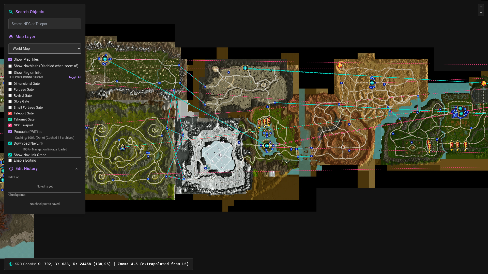

# OpenSilkroadMap

The hackable [**Silkroad Online**](http://www.joymax.com/silkroad/) world map.



## Features

- Explore the world map, dungeons and navmeshes
- Search objects (NPCs, teleporters)
- [NavLink](https://github.com/Silkroad-Developer-Community/Silkroad-NavLink) integration
- Teleport actions, displays
- Show coordinates, region on hover
- Cachable zoom levels
- Generate maps for any Silkroad Online version with only a few scripts

## Getting Started

### Prerequisites

- [Node.js](https://deno.com/) (v18+)
- [Python 3.10+](https://www.python.org/) with [uv](https://github.com/astral-sh/uv) (recommended) or standard pip for asset processing.

### 1. Install Dependencies

```shell
deno install
```

### 2. Extracting Client Files (.pk2)

Canonical pipeline (vSRO 1.193):

```
PK2 root -> extract -> game_source/ -> generate -> map/public/assets/gamedata/
```

This repository does **not** include `pk2reader.py` / `jmblowfish.py`. Supply them
next to the archives with `--reader-dir` (defaults to `--pk2-dir`). Expected API:
`PK2(path)`, `.find(path)`, `.read_file(entry)`. Blowfish key for these archives
is `169841` (see `EXTERNAL_PACKAGE_INVENTORY.md`). Nested client/server/DB/PK2
listings and blockers: `VSRO_V193_SOURCE_INVENTORY.md`. `Media.pk2` is in
`VSRO-R Client.7z`; the other four PK2s are in `PK2 Files.7z`.

Expected layout (either flat or nested):

```
<pk2-dir>/
  Data.pk2  Map.pk2  Media.pk2  Music.pk2
  listing_media.txt  listing_music.txt   # optional, for UI/icon/audio extractors
```

or `<pk2-dir>/pk2/*.pk2` with listings next to `pk2/`.

Do not hardcode a machine path. Pass `--pk2-dir` / `--output-dir` or set
`SRO_PK2_DIR`, `SRO_READER_DIR`, `SRO_SOURCE_DIR`, `SRO_OUTPUT_DIR`.

Validate without archives:

```shell
python3 scripts/extract_sro.py validate
python3 scripts/test_sro_pipeline.py
```

Extract + generate when you have PK2s and the reader:

```shell
python3 scripts/extract_sro.py extract --pk2-dir /path/to/pk2s --reader-dir /path/to/reader
python3 scripts/extract_sro.py generate --source-dir game_source --output-dir map/public/assets/gamedata
```

You can also extract archives with [pk2_mate](https://github.com/Veykril/pk2/releases)
into `game_source/` and skip the in-repo PK2 reader:

```shell
mkdir game_source
pk2_mate extract --archive "C:\Games\SRO\Media.pk2" --out game_source/Media
pk2_mate extract --archive "C:\Games\SRO\Data.pk2" --out game_source/Data
pk2_mate extract --archive "C:\Games\SRO\Map.pk2" --out game_source/Map
```

`map/src/game/data/` is the committed Phase H starter JSON (bundled). Full
`map/public/assets/gamedata/` is generated and optional at runtime (shops/quests
degrade if missing). Do not commit PK2 archives or `game_source/`.

### 3. Processing Silkroad Assets

```shell
uv run scripts/convert_ddjs.py
uv run scripts/generate_tiles.py
uv run scripts/generate_navmesh.py
uv run scripts/generate_game_data.py --source-dir game_source
uv run scripts/generate_phase_h_data.py --source-dir game_source
uv run scripts/build_game_database.py --source-dir game_source --output-dir map/public/assets/gamedata
```

### 4. Run the Development Server

```shell
deno task dev
```

Open [http://localhost:3000](http://localhost:3000) in your browser.

## Credits

- Initial work done by [Jellybitz](https://github.com/JellyBitz) on [xSROMap](https://github.com/JellyBitz/xSROMap)
- Integrated changes made on [kis1yi](https://github.com/kis1yi)'s [fork](https://github.com/kis1yi/xSROMap)
- Adjustments, cleanup, integrations to OasisBot and scripts to further improve reproducibility by [Egezenn](https://github.com/Egezenn)

## TODO

- Teleporter imports
- Opacity sliders for layers
- Deployment
- OasisBot connection
  - Dungeon integration (on NavLink display, need to quantize heights on dungeon regions so that they don't render on top of each other)
